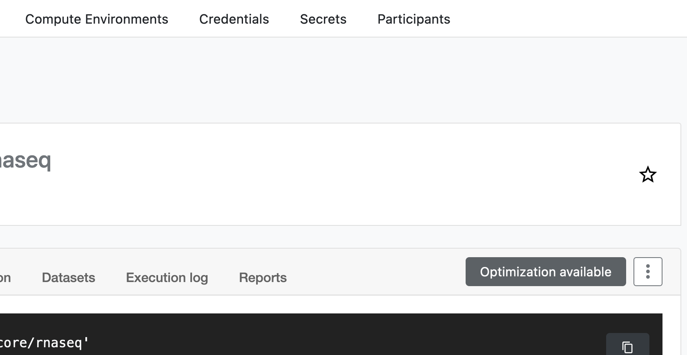

# Nextflow

## Introduction

Nextflow is a workflow language and executor for reproducible, containerized bioinformatics. The following serves as a quick, comparative reference for different ways you can run the same workflow, including ones you write yourself. See e.g. our [Bulk RNA-Seq Guide](./RNA-Seq/bulk.md) or the official [nf-core](https://nf-co.re) site for more in-depth parameter information for any examples.

!!! tip
    Due to Nextflow's intermediate file size requirements, we offer `/srv/scratch/genomicwf` for all BABS users with the limitation that **files are deleted irreversibly after 3 days of not being read**. Within this time-frame, you can `-resume` quickly with modified parameters. If lab scratch is preferred, we encourage the regular use of `nextflow clean`.

## Launching a Workflow
<!--- https://www.docsy.dev/docs/adding-content/shortcodes/#tabbed-panes -->
New to Katana? You should review the [Katana Guide](./katana.md) before using any of the following methods.

!!! note "Platform"
    === "Katana OnDemand"
        With a few clicks, you can run highly maintained, peer-reviewed nf-core community workflows on Katana OnDemand using a graphical user interface, directly on reads from Ramaciotti.

        1. <s>Access the utility [here](../support.md#contact-the-research-technology-services-team){target=”_blank”}</s>. You must be at UNSW, or be logged in via VPN.

        <figure>
            <iframe width="400" height="200" src="https://www.youtube.com/embed/ppmbZKVxj2A" title="Tutorial" frameborder="0" allow="accelerometer; autoplay; clipboard-write; encrypted-media; gyroscope; picture-in-picture; web-share" allowfullscreen></iframe>
            <figcaption>Demonstrating initial steps of RNA-Seq</figcaption>
        </figure>

        2. (Optional) To uninstall, delete ~/ondemand/data/workflows_beta_4, and any datasets/runs you created
        
    === "Command-Line"
        The following instructions can be applied for community workflows or your own:

        1. Connect via ssh
            ``` bash
            ssh <zid>@kdm.restech.unsw.edu.au # (1)!
            ```
            1. It's best to use the Katana Data Mover node especially for step 3.

        2. Create and enter a new project folder
            ``` bash
            mkdir -p /srv/scratch/genomicwf/$USER/myproject && cd $_  # (1)!
            git clone https://github.com/WalshKieran/katana-rnaseq-start.git . # (2)!
            ```
        
            1. Files stored in the "genomicwf" scratch are deleted if unused for 3 days. Nextflow working directories can exceed 1TB, but you may wish to try different parameters without recomputing everything within this timeframe.
            2. This copies a PBS batch template into your project folder. It will fail if there are any files already present.

        3. (Optional) Download your data from Ramaciotti and create samplesheet:
            ``` bash
            wget -qO- https://mydata.ramaciotti...MYDATA1234.tar | tar xvz -C ./mydata1234 # (1)!
            wget https://raw.githubusercontent.com/nf-core/rnaseq/master/bin/fastq_dir_to_samplesheet.py
            python3 fastq_dir_to_samplesheet.py --recursive ./mydata1234 ./samplesheet.csv
            ```

            1. Follow the instructions from Ramaciotti - if access is via BaseSpace or a non-tar share link, you can use the "Katana OnDemand" utility to download.
        
        4. Launch and monitor
            ``` bash
            qsub run.pbs
            qstat -u $USER
            tail .nextflow.log
            ```
        
        4. (Optional) Stop your job
            ``` bash
            qsig <ID returned from qsub> # (1)!
            ```

            1. Why not qdel? When exiting, Nextflow waits for all child jobs to exit - this can take more time than qdel allows.

    === "Nextflow Tower"
        Nextflow Tower is a more advanced interface for launching and monitoring Nextflow workflows, but you will need to move data on and off Katana yourself using the Katana Data Mover.

        !!! bug
            Tower is still slightly incompatible with Katana as of June 20, 2023.


        One-off setup:
        
        1. Create a Tower account at [https://tower.nf](https://tower.nf).
        2. Navigate to [https://tower.nf/tokens](https://tower.nf/tokens), create and copy an access token.
        3. Paste your token into the "Katana OnDemand" workflow utility sidebar to automatically add Katana credentials/compute and even nf-core community workflows to your Tower personal workspace.

        We currently do not support group workspaces, as sharing login credentials is against the Katana usage policy.


## Resources (Advanced)

The default allocations from nf-core community workflows are extremely generous for most datasets - this may negatively impact your queue priority and run duration. If your input files are reasonably similar, you should consider configuring each process based on measurements.

!!! note "Optimization"
    === "Katana OnDemand"
        See video in [Launching a Workflow](#launching_a_workflow) - the graphical interface interactively encourages the process described in "Command-Line".
    === "Command-Line"
        Below is an illustration of how to run nf-core/rnaseq without previous similar runs (e.g. similar or greater read depth). This is not a substitute for reading the [nf-optimizer](https://github.com/WalshKieran/nf-optimizer) documentation/drawbacks carefully.

        1. Limit the samples in your samplesheet, or by other means
        ``` bash
        head -n 5 samplesheet.csv > samplesheet_4.csv
        ```

        1. Run Nextflow on limited samples
        ``` bash
        export NXF_ENABLE_CACHE_INVALIDATION_ON_TASK_DIRECTIVE_CHANGE=false
        nextflow run ... --input samplesheet_4.csv
        ```

        3. Generate resources.config (limited to ~120GB, 12 hours)
        ``` bash
        nf-optimizer -m 500 120000 -t 300 43200 -o resources.config .
        ```

        4. Run Nextflow on all samples
        ``` bash
        export NXF_ENABLE_CACHE_INVALIDATION_ON_TASK_DIRECTIVE_CHANGE=false
        nextflow run ... --input samplesheet.csv -c resources.config -resume
        ```
    === "Nextflow Tower"
        Nextflow Tower supports optimization based on a specific previous run. Click on a run in your history, navigate to "Optimization Available", and copy the configuration.

        <figure markdown>
            { width="400" }
            <figcaption>Nextflow Tower built in optimization</figcaption>
        </figure>
