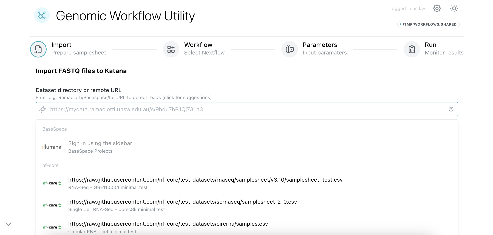
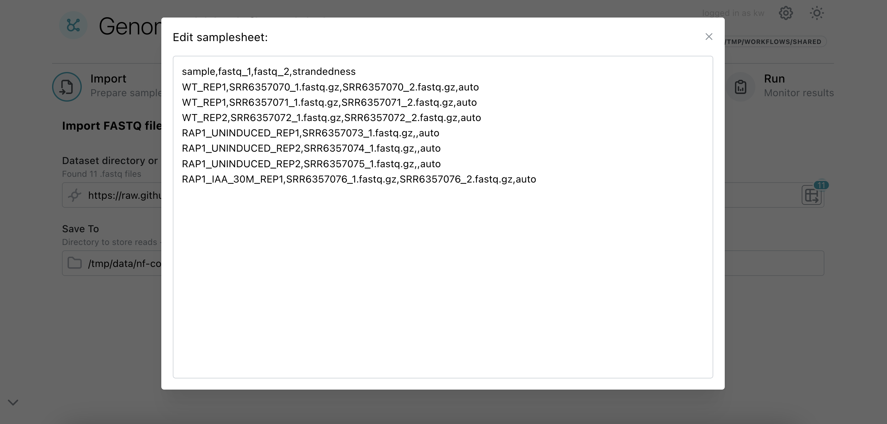

# Bulk RNA-Seq

## Introduction

Bulk RNA-seq involves sequencing the RNA extracted from a population of cells or tissues as a whole for the purpose of counting, while attempting to maintain proportionality with e.g. actual transcript expression. This is complicated by the need to convert to cDNA for sequencing, various biases and in eukaryotes - isoforms.

In this guide, we will use the best-practices Nextflow workflow, *nf-core/rnaseq* [(view official docs)](https://nf-co.re/rnaseq){target=”_blank”}. You can review alternate ways to run these steps (including command-line, Tower) in the general [Nextflow](../nextflow.md) section - the focus of this page will be on general steps and biological parameters.

## Importing your Data

The workflow accepts fastq reads, which can be downloaded using the "Import" step of the [Genomic Workflow Utility](../../getting_started.md). This will also produce a valid samplesheet.csv automatically, but you may want to set the [strandedness](./experimental_design.md#strandedness) column explicitly.

<figure markdown>
{ width="400" }
<figcaption>The import field accepts Ramaciotti URLs, local paths, etc.</figcaption>
</figure>
<figure markdown>
{ width="400" }
<figcaption>Possible to change strandedness from auto to e.g. reverse</figcaption>
</figure>

## Choosing Parameters

You should carefully read the full parameter list on the [official docs](https://nf-co.re/rnaseq){target=”_blank”}, which may further refer you to specific tool manuals. Below is a tiny subset of frequently used parameters.

| Parameter | Summary |
| - | - |
| --input | Path to samplesheet. Filled for you automatically when using Genomic Workflow Utility |
| --genome | (required or see below) iGenome name, not to be confused with an actual fasta file path |
| --fasta, --gtf | (required or see above) In most cases, these should be what you use instead of an iGenome name. There is also a --gff option, more common in microbiology. It accepts a URL e.g. https://ftp.ensembl.org/../primary_assembly.fa.gz but you may want to keep local copies and supply a path, since the download is rather slow. nf-core wants to support RefGenie in future.
| --max-memory | (optional) The default, 120GB, is more than enough for bulk RNA-Seq unless you are using HISAT, which works best with 200GB. | 
| ... | ... |

    
## Running the Workflow

nf-core/rnaseq can typically take 4 hours for human reads, but this obviously depends greatly on read depth / size of each fastq file. See the [frequently used](../../overview.md#frequently-used) table for more metrics.

### Common Errors
#### 1. Out of space
    
e.g. `Failed to write...`, `File does not exist`

If a cryptic filesystem error occurs, always [check how much space is available](../../getting_started.md#checking-available-space) in the output folder first - failing to write a file or read from an expected file can imply this. 

#### 2. Out of memory
    
e.g. `java.lang.OutOfMemoryError: Java heap space`

Subtasks will be retried if they run out of memory, but the main Nextflow job will fail - this should not happen with bulk RNA-Seq, since it's usually when docker containers need to be converted to SIF.

#### 3. Missing parameter

`Genome fasta file not specified with e.g. '--fasta genome.fa' or via a detectable config file.`

Happens more than it should because "fasta" isn't a required field. For interfaces, the genome/fasta/gtf/gff fields are under "Reference genome options", refer to the [Choosing Parameters](#choosing-parameters).

### Support
The advantages of using a popular community workflow is that there are many people globally that can help. Contact us at [ResTech](../../support.md#contact-the-research-technology-services-team) for specific errors or questions. There is also a [nf-core slack](https://nf-co.re/join#slack) with channels for questions and each workflow.
