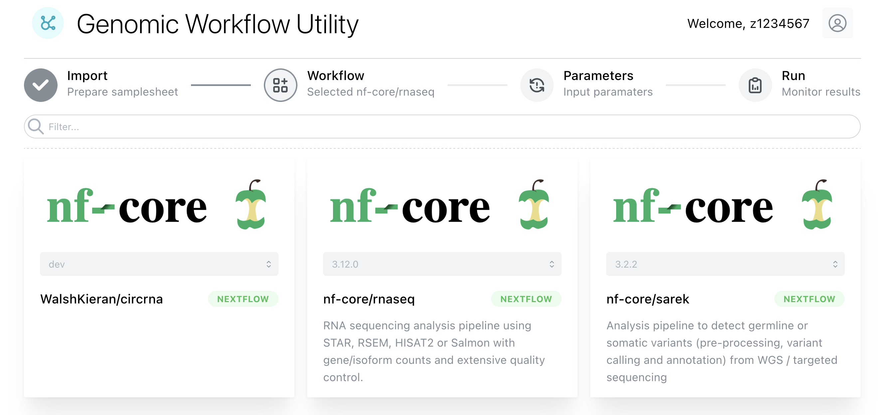

Title: Introduction to the Genomics Workflow Platform (GWP) 

## 
The goal of the Genomics Workflow Platform is to implement commonly used pipelines for the analysis of next-generation sequencing data on the UNSW High-Performance Computing (HPC) Infrastructure. “Genomics” is used here in a broad sense, including transcriptomics and epigenomics.

There are over 75 nf-core community workflows, below are some that we have manually tested on Katana. View the full list [here](https://nf-co.re/pipelines) - note [nf-core/proteinfold](https://nf-co.re/proteinfold) is not currently supported, as there are better ways of doing this at UNSW.

<figure markdown>
{ width="400" }
<figcaption>via Katana OnDemand</figcaption>
</figure>

### Frequently Used
| Workflow 	| Summary 	| Expected Space* 	| Expected Time* 	| Guide 	|
|---	|---	|---	|---	|---	|
| [nf-core/rnaseq](https://nf-co.re/rnaseq){target=”_blank”}	| Turns .fastq files and annotated genome into trimmed and aligned .bam files, detailed multiqc and gene count matrix. You can then perform differential expression in e.g. R. Typically takes around 4 hours and 1-2TB of space for human data. Note [for prokaryotes]( https://nf-co.re/rnaseq/3.12.0/usage#prokaryotic-genome-annotations ). 	| 1-2TB 	| 4hr 	| [Bulk Rna-Seq](./Guides/RNA-Seq/bulk.md) 	|
| [nf-core/scrnaseq](https://nf-co.re/scrnaseq){target=”_blank”} 	| RNA-Seq for 10x single cell data, supporting Alevin, STARSolo, Kallisto, Cellranger, UniverSC. 	| 2TB 	| 6hr 	|  [Single-Cell Rna-Seq](./Guides/RNA-Seq/single_cell.md)	|
| [nf-core/circrna](https://nf-co.re/circrna){target=”_blank”} 	| Still under development/unfinished - [our fork](https://github.com/WalshKieran/circrna/tree/dev) fixes some minor ongoing issues, but should not be relied upon. Long duration is specificlly due to CIRI2.	| 4TB 	| 48hr 	| [Circular Rna-Seq](./Guides/RNA-Seq/circular.md)	|

(*) These metrics obviously depend greatly on sequencing depth, genome size and (in the case of space) number of samples. The current estimates are based on multiple human datasets.

## Reproducibility

Nextflow on Katana is configured to use Singularity containers. This means that when you specify an exact version of a pipeline that utilises containers, identical builds of each software will be used.

