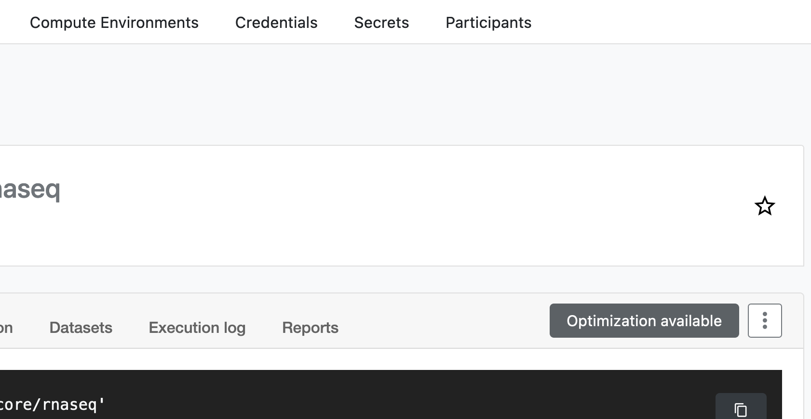

title: Genomic Workflow Utility

Nextflow is a workflow language and executor for reproducible containerized bioinformatics. We have created a Katana configuration file for Nextflow users.

!!! info
    Due to Nextflow's significant intermediate file size requirements (sometimes over 1TB), we offer **/srv/scratch/genomicwf** for all BABS users with the limitation that **files are deleted irreversibly after 3 days of not being read**.

    Within this time-frame, you can `-resume` quickly with modified parameters. If lab scratch is preferred, we encourage the regular use of `nextflow clean`. This scratch can be used regardless of the method chosen in "Running a workflow".

## Running a workflow
<!--- https://www.docsy.dev/docs/adding-content/shortcodes/#tabbed-panes -->

!!! note "Platform"
    === "Command-Line"
        1. Connect via ssh
            ``` bash
            ssh <zid>@kdm.restech.unsw.edu.au # (1)!
            ```
            1. It's best to use the Katana Data Mover node especially for step 3.

        2. Create and enter a new project folder
            ``` bash
            mkdir -p /srv/scratch/genomicwf/$USER/myproject && cd _  # (1)!
            git clone https://github.com/WalshKieran/katana-rnaseq-start.git . # (2)!
            ```
        
            1. Files stored in the "genomicwf" scratch are deleted if unused for 3 days. Nextflow working directories can exceed 1TB, but you may wish to try different parameters without recomputing everything within this timeframe.
            2. This copies a PBS batch template into your project folder. It will fail if there are any files already present.

        3. Download your data from Ramaciotti and create samplesheet (optional):
            ``` bash
            wget -qO- https://mydata.ramaciotti...MYDATA1234.tar | tar xvz -C ./mydata1234 # (1)!
            wget https://raw.githubusercontent.com/nf-core/rnaseq/master/bin/fastq_dir_to_samplesheet.py
            python3 fastq_dir_to_samplesheet.py --recursive ./mydata1234 ./samplesheet.csv
            ```

            1. Follow the instructions from Ramaciotti - if access is via BaseSpace or a non-tar share link, you can use the "Katana OnDemand" utility to download.
        
        4. Launch and monitor
            ``` bash
            qsub run.pbs
            qstat -u $USER
            tail .nextflow.log
            ```


    === "Katana OnDemand"
        In collaboration with BABS, Katana OnDemand offers a graphical interface for quickly running the latest nf-core community workflows on remote datasets without any HPC experience or configuration. It supports importing fastq files directly from Ramaciotti and exporting results to the UNSW Data Archive. 
        
        It is a good starting-point for workflows that only require a samplesheet and parameters as input (e.g. bulk/single-cell RNA-Seq).

        1. Launch via [Katana OnDemand](https://kod.restech.unsw.edu.au/pun/usr/z5075661/workflows_beta_3)

        <figure>
            <iframe width="560" height="315" src="https://www.youtube.com/embed/FrOLKIHuRCs" title="YouTube video player" frameborder="0" allow="accelerometer; autoplay; clipboard-write; encrypted-media; gyroscope; picture-in-picture; web-share" allowfullscreen></iframe>
            <figcaption>Demonstrating the initial steps of RNA-Seq</figcaption>
        </figure>
        
    === "Nextflow Tower"
        Nextflow Tower is a more advanced interface for launching and monitoring Nextflow workflows, but you will need to move data on and off Katana yourself using the Katana Data Mover.

        One-off setup:
        
        1. Create a Tower account at [https://tower.nf](https://tower.nf).
        2. Navigate to [https://tower.nf/tokens](https://tower.nf/tokens), create and copy an access token.
        3. Paste your token into the "Katana OnDemand" workflow utility sidebar to automatically add Katana credentials/compute and even nf-core community workflows to your Tower personal workspace.

        We currently do not support group workspaces, as sharing login credentials is against the Katana usage policy.

## Optimizing Resources

The default allocations from nf-core community workflows are extremely generous for most datasets - this may negatively impact your queue priority and run duration. If your input files are reasonably similar, you should consider configuring each process based on measurements.

!!! note "Optimization"
    === "Command-Line"
        Below is an illustration of how to run nf-core/rnaseq without previous similar runs (e.g. similar or greater read depth). This is not a substitute for reading the [nf-optimizer](https://github.com/WalshKieran/nf-optimizer) documentation/drawbacks carefully.

        1. Limit the samples in your samplesheet, or by other means
        ``` bash
        head -n 5 samplesheet.csv > samplesheet_4.csv
        ```

        1. Run Nextflow on limited samples
        ``` bash
        export NXF_ENABLE_CACHE_INVALIDATION_ON_TASK_DIRECTIVE_CHANGE=false
        nextflow run ... --input samplesheet_4.csv
        ```

        3. Generate resources.config (limited to ~120GB, 12 hours)
        ``` bash
        nf-optimizer -m 500 120000 -t 300 43200 -o resources.config .
        ```

        4. Run Nextflow on all samples
        ``` bash
        export NXF_ENABLE_CACHE_INVALIDATION_ON_TASK_DIRECTIVE_CHANGE=false
        nextflow run ... --input samplesheet.csv -c resources.config -resume
        ```

    === "Katana OnDemand"
        See video in [Running a workflow](#running-a-workflow) - the graphical interface interactively encourages the process described in "Command-Line".
    === "Nextflow Tower"
        Nextflow Tower supports optimization based on a specific previous run. Click on a run in your history, navigate to "Optimization Available", and copy the configuration.

        <figure markdown>
            { width="400" }
            <figcaption>Nextflow Tower built in optimization</figcaption>
        </figure>


## Reproducibility

Nextflow on Katana is configured to use Singularity containers. This means that when you specify an exact version of a pipeline that utilizes containers, identical builds of each software will be used.

